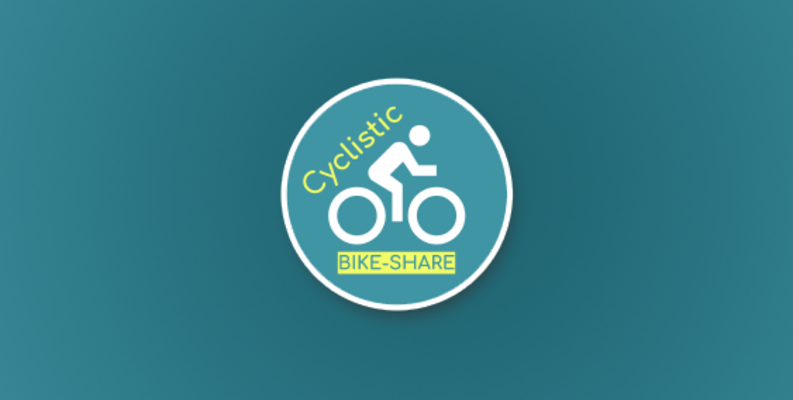

# Cyclistic Bike-Share Case Study


## Introduction
This case study is a part of the Google Data Analytics Certificate specialization. I believe it will help me in strengthening my data analysis skills as I will be using different tools that I have learned from this specialization in addition to other courses on a real-world dataset and a real scenario.I will use these steps in my data analysis process: [Ask](README.md#ask), [Prepare](README.md#prepare), [Process](README.md#process), [Analyze](README.md#analyze), [Share](README.md#share), and [Act](README.md#act).

### Quick Links
Online Data Sourcs: 

[Cyclistic Data 2023](https://divvy-tripdata.s3.amazonaws.com/index.html)

SQL Queries:

[1.Data Combining](data_combining.sql)

[2.Data Exploration](data_exploration.sql)

[3.Data Cleaning](data_cleaning.sql)

[4.Data Analysis](data_analysis.sql)

Power BI:

[Dashboard](Cyclistic_Dashboard.pdf)


## Background
The case study is about a fictional bike share company called “Cyclistic” based in Chicago that has been operating since 2016 and has grown to own 5,824 bikes across 692 stations. They have two types of riders: casual riders that use the service for one ride or full-day, and annual riders who are Cyclistic members. The company’s financial department has found that annual members are more profitable, and the marketing team, led by Moreno, sees an opportunity to convert casual riders into Cyclistic’s annual members as they are already familiar with Cyclistic services.

## Ask
### Key Business Tasks
The goal is to create a marketing strategy to increase the number of Cyclistic annual members by targeting casual riders. As a junior data analyst on the marketing team, I have been tasked with analyzing Cyclistic's historical data from the last 12 months to identify trends and patterns. Using this analysis, I will provide professional visuals, insights, and recommendations to inform marketing strategies.

### Business Questions
I will address the following key questions:
- How do annual members and casual riders use Cyclistic bikes differently?
- Why would casual riders be incentivized to purchase Cyclistic annual memberships?
- How can Cyclistic leverage social media to influence casual riders to become annual members?

### Key Stakeholders
- **Lily Moreno**: the director of the marketing department and my boss.
- **Cyclistic Executive Team**: who will decide whether or not to approve the recommended marketing program.

## Prepare
For this case study, I will be using Cyclistic historical trip data from Jan 2023 to Dec 2023, which has been made available online by Motivate International Inc. under the license. The data was prepared and downloaded in 12 CSV files, one for each month. Each file contains 13 columns which are:

- `ride_id`: ID for each ride
- `rideable_type`: Type of bikes used (electric_bike, classic_bike, docked_bike)
- `started_at`: The timestamp when the ride started
- `ended_at`: The timestamp when the ride ended
- `start_station_name`: Name of station where the bike is unlocked
- `start_station_id`: The start station ID
- `end_station_name`: Name of station where the bike is locked
- `end_station_id`: The end station ID
- `start_lat`: Start latitude
- `start_lng`: Start longitude
- `end_lat`: End latitude
- `end_lng`: End longitude
- `member_casual`: Type of the rider

## Process
Given that the dataset contains over 2,000,000 rows, Excel isn’t suited to handle it efficiently. Instead, we chose Microsoft SQL Server for data manipulation, as it is built to manage and process large datasets effectively. In this step we imported, combined and cleaned data to be ready for analysis.

### A) Data Combining
The data was initially spread across multiple Excel files, so we needed to consolidate them in Microsoft SQL Server. To start, we created a database named “Cyclistic_data” and imported all 12 Excel files into this database. Next, we created a staging table called “CyclisticStagingTable” to merge the data from all 12 files into one comprehensive table. This approach enabled efficient management and analysis of the data as a single, unified dataset.
```sql
-- Creat staging table to combine the tables.

CREATE TABLE CyclisticStagingTable (
    ride_id VARCHAR(255),   
    rideable_type VARCHAR(255),
    started_at DATETIME,
    ended_at DATETIME,
    start_station_name VARCHAR(255),
    start_station_id VARCHAR(255),
    end_station_name VARCHAR(255),
    end_station_id VARCHAR(255),
    start_lat FLOAT,
    start_lng FLOAT,
    end_lat FLOAT,
    end_lng FLOAT,
    member_casual VARCHAR(255)
);
```
```sql
-- Insert data into the staging table.
INSERT INTO CyclisticStagingTable
SELECT * 
FROM tripdata_202301
UNION ALL 
SELECT * 
FROM tripdata_202302
UNION ALL 
SELECT * 
FROM tripdata_202303
UNION ALL 
SELECT * 
FROM tripdata_202304
UNION ALL 
SELECT * 
FROM tripdata_202305
UNION ALL 
SELECT * 
FROM tripdata_202306
UNION ALL 
SELECT * 
FROM tripdata_202307
UNION ALL 
SELECT * 
FROM tripdata_202308
UNION ALL 
SELECT * 
FROM tripdata_202309
UNION ALL 
SELECT * 
FROM tripdata_202310
UNION ALL 
SELECT * 
FROM tripdata_202311
UNION ALL 
SELECT * 
FROM tripdata_202312;

SELECT TOP 5 * 
FROM CyclisticStagingTable
```
### Data Exploration
Before analyzing the data, we need to familiarize ourselves with it. Our data contains 13 columns with the `ride_id` as the unique column, which is our primary key, and 5,719,877 records. We did the following steps to ensure our data is ready for analysis:

#### Duplicated Values
We first checked for duplicates using `ride_id` as it has unique values:
- We found no duplicates in the data.

#### Null Values
We found null values in several columns that needed to be removed:
- 875,716 nulls in `start_station_name`
- 875,848 in `start_station_id`
- 929,202 in `end_station_name`
- 929,343 in `end_station_id`
- 6,990 in each of `end_lat`, `end_lng`

#### Distinct Values
In column `rideable_type`, we have three types of bikes: Classic bike, Electric bike, and Docked bike, and column `member_casual` has two unique values: member and casual riders.

#### Outliers
We checked for outliers that could shift our data results:
- **Less than a minute rides**: This duration is likely an anomaly, as it doesn't provide enough time for a meaningful ride.
- **More than 24 hours rides**: Such rides are also unusual, as they exceed typical usage patterns for bike rentals.

We found 6,333 rides that took more than 24 hrs. and 88,950 rides that took less than a minute. These rides were removed.

### B) Data Cleaning
We created another table called `cyclistic_tbl` with all cleaned data by removing all null values and outliers as it’s a case study and we can’t ask the company about these anomalies. The new table also included newly created columns needed for the analysis, such as:

- `ride_length`: the length of each ride
- `day_of_week`: day number extracted from `started_at`
- `day_name`: names of the days
- `ride_month`: the month of the ride
- `month_name`: the name of months
- `ride_year`: the year of the ride

1,439,662 records were removed, and now the data is cleaned, including all necessary columns, and is ready to be analyzed.
```sql
-- Create new table with cleaned data.
SELECT 
ride_id,
rideable_type AS bike_type,
started_at,
ended_at,
DATEDIFF(minute,started_at,ended_at) AS ride_length,
DATEPART(WEEKDAY, started_at) AS day_of_week,
DATENAME(WEEKDAY, started_at) AS day_name,
DATEPART(MONTH, started_at) AS ride_month,
DATENAME(MONTH, started_at) AS month_name,
DATEPART(YEAR, started_at) AS ride_year,
start_station_name,
start_station_id,
end_station_name,
end_station_id,
start_lat,
start_lng,
end_lat,
end_lng,
member_casual AS rider_type
INTO cyclistic_tbl
FROM CyclisticStagingTable
WHERE start_station_name IS NOT NULL
   AND start_station_id IS NOT NULL
   AND end_station_name IS NOT NULL
   AND end_station_id IS NOT NULL
   AND end_lat IS NOT NULL
   AND end_lng IS NOT NULL -- Remove all null values.
   AND DATEDIFF(MINUTE, started_at, ended_at) >= 1 -- remove rides less than a min.
   AND DATEDIFF(MINUTE, started_at, ended_at) <= 1440; -- remove rides more than 24hrs.
```

## Analyze
We used SQL to analyze trends and distinguish behavioral patterns between member and casual riders. Power BI was then utilized to visualize these insights, enabling a clear and interactive presentation of the findings.

### Total Rides in 2023
The dataset includes a total of approximately 4 million rides, with 2,763,533 rides by members and 1,516,682 rides by casual riders. This breakdown equates to 64.57% member rides and 35.43% casual rides, highlighting strong engagement among members compared to casual users.


### Bike Type

Classic bikes and electric bikes are used by both member and casual riders, with electric bikes being the most used type. Docked bikes are the least used and are only used by casual riders.


### Rides Frequency by Hour

- **Member Riders**: Peak hours are between 6 AM - 10 AM and 3 PM - 7 PM, with the highest activity at 5 PM, indicating commuting patterns.
- **Casual Riders**: Increased activity throughout the day, peaking at 5 PM, suggesting leisurely usage.


### Rides Frequency and Average Duration by Day
- **Member Riders**: Ride frequency is higher on weekdays, with longer rides on weekends.
- **Casual Riders**: Ride frequency is higher on weekends, with longer ride durations on Saturdays and Sundays.


### Rides Frequency and Average Duration by Month
- **Summer**: Both groups ride more frequently with longer durations.
- **Winter**: Lower ride frequency and shorter durations.


### Average Ride Duration
- **Casual Riders**: Average ride duration is 23.04 minutes, indicating leisure usage.
- **Member Riders**: Average ride duration is 12.28 minutes, suggesting routine trips.


### Top Stations

This visual shows the top 5 bike stations for member and casual riders:
- **Clark St & Elm St**: Top station for members.
- **Streeter Dr & Grand Ave**: Top station for casual riders.


  
### Analysis Summary
| Metric                      | Member Riders                                | Casual Riders                                           |
|-----------------------------|----------------------------------------------|--------------------------------------------------------|
| **Total Rides (2023)**      | 2,763,533 rides (64.57%)                    | 1,516,682 rides (35.43%)                               |
| **Bike Type**               | Classic bikes and electric bikes.            | Classic bikes, electric bikes, docked bikes (only used by casual riders; least used overall) |
| **Rides Frequency by Hour**  | Highest activity during commuting hours: 6-10 AM & 3-7 PM, peak at 5 PM. Minimal activity from midnight to 5 AM. | Increased activity throughout the day, peak at 5 PM. Minimal activity from midnight to 5 AM. |
| **Rides Frequency by Day**   | More frequent rides on weekdays, especially Wed & Thu, longer duration on weekends | Higher frequency on weekends, especially Sat & Sun, longer ride durations on these days |
| **Rides Frequency by Month** | Peaks in August during summer, lowest in winter (Dec, Jan, Feb) | Peaks in July during summer, lowest in winter (Dec, Jan, Feb) |
| **Average Ride Duration**    | 12.28 minutes – shorter, indicating commute usage | 23.04 minutes – longer, suggesting casual outings      |
| **Top Station**              | Clark St & Elm St                           | Streeter Dr & Grand Ave                                |

## Share
Connecting Power BI to Microsoft SQL enabled a direct and efficient way to access and visualize cleaned data, ensuring data accuracy and consistency across reports.


## Act
Since, the aim is to make casual member convert to annual subscription we recommend the following:
-	We can target casual riders that rides frequently, with app notifications or emails including the number of rides they took as well as the money that they could save if they subscribed annually with providing an offer.
-	Since, casual riders are the only riders that uses docked bikes, we can use flyers or stickers on those bikes with annual subscription offer or personalized notifications providing an annual offer as QR codes that takes you to subscription page directly to make it easier for riders to subscribe on spot.

-	Since casual riders tends to take long rides why not offer them milestone rewards program that celebrates rides count (25, 50, 100) rides and for each milestone we can give them promos and offers with highlighting the perks for annual subscription this could add a sense of progression that keeps riders engaged.

-	As our data suggests that casual riders take most of their rides in weekends and possibly with friends or family, we can give a friends offer with annual subscription as riders can have free rides for their companion friends at weekends (weekend companion perk).


-	Summer is the most season with the highest activity, cyclistic can do summer events campaigns by partnering with festivals or camps and there we can make cyclistic both and our ushers can talk about the summer event only discounts offer for annual subscription and give the availability to subscribe on spot.

 
-	We can encourage casual riders to ride more frequently in weekdays by giving bonuses to the number of rides taken through the week like week streak and for each streak we can give them annual subscription discount that increases gradually for every streak to make them more convinced with annual subscription.

## Conclusion 
The main goal of this case study was to create a marketing strategy in order to encourage casual riders to convert to annual subscription which will increase the company revenues. Through our data analysis we dicovered patterns and trends in the behviour of casual riders that helped us in counstructing our recommendation and by applying these recommendations our goal will be met.
## I learned
- This was my first experience working with a dataset of over 4 million rows. I successfully combined multiple files using Microsoft SQL Server, which helped me develop my skills in handling large volumes of data.
- After merging the datasets, I focused on cleaning the data to ensure its accuracy and usability. This process deepened my understanding of data quality and preparation.
- I then connected the cleaned data to Power BI, where I created a simple and user-friendly dashboard. Utilizing DAX for calculations and measures, I was able to provide valuable insights through visualizations.
